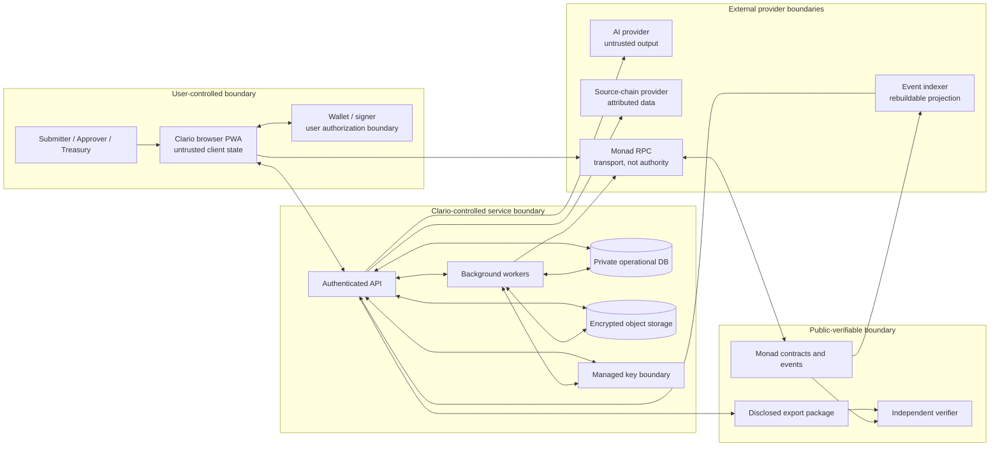

# Clario MVP Threat Model

**Status:** Approved by founder  
**Version:** 1.0  
**Last reviewed:** 2026-09-15  
**Scope:** MVP from private evidence intake through exact-version approval, Monad registration, reimbursement, export, and independent verification  
**Governing policy:** [RULES.md](./RULES.md)  
**Architecture:** [architecture.md](./architecture.md)  
**Product requirements:** [prd.md](./prd.md)

> This document describes threats and required controls. A listed control is not implemented or effective merely because it appears here. Control status and validation evidence determine whether a flow may ship.

## 1. Security objective

Clario must keep business evidence private while making version integrity, reviewer authority, correction history, and reimbursement independently verifiable. The primary security objective is therefore not “put expenses onchain.” It is to preserve a narrow proof chain without exposing the private record or allowing stale, unauthorized, substituted, or duplicate financial action.

The proof chain is:

```text
private record + evidence
  → deterministic immutable version commitment
  → authorized decision over that exact version
  → settlement of the current approved version only
  → independently reproducible verification
```

Any implementation that appears to complete this chain while bypassing privacy, exact-version authority, real receipt validation, or independent verification is a security failure.

## 2. Scope and security states

### In scope

- Browser application and local client state.
- Session authentication and workspace authorization.
- Clario API and background jobs.
- Operational database and encrypted object storage.
- Evidence encryption and key-management boundary.
- Wallet signing and transaction confirmation.
- Monad contracts, RPC access, and event ordering.
- Event indexer and reorganization handling.
- Source-chain transaction provider and direct-RPC fallback.
- AI extraction provider and untrusted model output.
- Export package and independent verifier.
- Build dependencies, CI, deployment configuration, and deployment manifest.

### Out of scope as a guaranteed property

Clario does not prove merchant authenticity, legal identity, business purpose, tax treatment, source-chain truth from a stored hash alone, or AI correctness. Those are claim-boundary constraints, not missing marketing opportunities.

### Control status vocabulary

| Status | Meaning |
|---|---|
| `VERIFIED` | Implemented and supported by current reproducible evidence |
| `PARTIAL` | Some supporting control exists, but the end-to-end threat remains open |
| `PLANNED` | Required before the owning workflow may ship |
| `BLOCKED` | A named decision, dependency, or validation prevents safe implementation or release |
| `ACCEPTED` | Residual risk explicitly accepted by a named human reviewer with expiry |

No P0 risk may become `ACCEPTED` through agent judgment alone.

## 3. Assets and security properties

| Asset | Required properties | Consequence if lost |
|---|---|---|
| Receipt, invoice, and evidence bytes | Confidentiality, integrity, authorized availability | Business/private-data breach; unverifiable record |
| Merchant, purpose, category, notes, and user identity | Confidentiality and workspace isolation | Personal or commercial harm |
| Commitment salt and encryption keys | Confidentiality, uniqueness, recoverability according to policy | Offline guessing, bulk evidence disclosure, permanent loss |
| Session and wallet-authentication state | Integrity, confidentiality, freshness | Account or workspace takeover |
| Workspace membership and role policy | Integrity, historical traceability | Unauthorized decisions or treasury action |
| Immutable expense versions | Integrity, ordering, non-equivocation | Approval of different content than reviewed |
| Approval/rejection authority | Authenticity, exact-version binding, replay resistance | Fraudulent or stale decisions |
| Treasury funds and allowance | Integrity, least authority, duplicate protection | Irrecoverable financial loss |
| Settlement recipient, token, and amount | Integrity, explicit intent, exact-version binding | Recipient or asset substitution |
| Monad transactions and events | Authenticity, finality state, canonical ordering | False success or incorrect proof |
| Source-chain facts | Provenance, freshness, attributable uncertainty | Incorrect expense association |
| AI inputs and outputs | Input confidentiality, output attribution, non-authority | Leakage or automated unsafe action |
| Deployment manifest and ABI | Integrity, environment binding, append-only history | Wrong-chain or wrong-contract execution |
| Export package and verifier | Integrity, deterministic behavior, independence | Misleading proof or concealed tampering |
| CI and dependency graph | Integrity, reproducibility, least privilege | Malicious code, secret theft, compromised release |

## 4. Actors and attacker capabilities

### Legitimate actors

- **Submitter:** creates and corrects expenses; may disclose evidence to authorized reviewers.
- **Approver:** reviews and decides on an exact expense version.
- **Treasury operator:** prepares and authorizes reimbursement of an eligible current version.
- **Workspace owner/admin:** manages policy and scoped roles without implicit evidence access.
- **Auditor/verifier:** checks disclosed packages and public facts independently.
- **Release operator:** configures and deploys reviewed artifacts after explicit authorization.

### Threat actors and failure sources

- An unauthenticated internet attacker.
- An authenticated user crossing workspace, role, or record boundaries.
- A compromised submitter, approver, treasury, admin, or release wallet.
- Malicious evidence content designed to exploit parsers or instruct an AI model.
- A compromised browser extension, frontend dependency, or served application bundle.
- A malicious or incorrect RPC, indexer, source-chain, storage, AI, or wallet provider.
- A dependency or CI action maintainer compromise.
- Operator error involving environment, chain, address, token, role, or deployment state.
- Normal chain behavior: reorganization, replacement, delayed finality, dropped transaction, or RPC disagreement.

The model assumes attackers can read public calldata/events, guess common private-field values, replay observed signatures or requests, race retries, modify client-side state, upload hostile files, and supply adversarial prompt content. The client, provider response, and indexer projection are never authoritative by themselves.

## 5. Data-flow and trust-boundary diagram



Arrows show possible data flow, not blanket authorization. Each crossing requires the controls in the next section.

## 6. Trust boundaries and allowed data

| ID | Boundary | Allowed crossing | Must not cross | Required control and verification |
|---|---|---|---|---|
| B-01 | Browser ↔ API | Session proof, validated form fields, authorized evidence transfer | Server secrets, cross-workspace records, raw configuration | TLS; session, CSRF, workspace/role/object authorization; input limits; authorization tests |
| B-02 | Browser ↔ wallet | Human-readable typed intent, exact chain/contract/calldata, receipt status | Private evidence fields not required by the public protocol | Chain check, simulation, domain separation, explicit confirmation, decoded receipt validation |
| B-03 | API ↔ database | Authorized private workflow fields and opaque public references | Unencrypted evidence bytes or key-encryption plaintext | Least-privilege account, workspace predicates, constraints, encryption at rest, cross-tenant tests |
| B-04 | API/jobs ↔ object storage | Ciphertext, encrypted metadata, authorized short-lived object requests | Public object access, plaintext key, indefinite signed URL | Private bucket, object authorization, method/object-bound URL, expiry tests, access audit |
| B-05 | API/jobs ↔ key service | Wrapped keys and authenticated encryption context | Raw master key in database, logs, or client | Envelope encryption, separate KEK authority, rotation/recovery test, key-access monitoring |
| B-06 | API ↔ AI provider | Minimum user-approved evidence subset needed for extraction | Secrets, unrelated workspace data, autonomous authority | Explicit configuration/consent, data minimization, tool-free schema-constrained request, DLP/log review |
| B-07 | API ↔ source-chain provider | Address/transaction query and attributed response | Private receipt/evidence or authentication authority | Response parsing, chain/hash validation, provider attribution, freshness, direct-RPC/manual fallback |
| B-08 | Browser/jobs ↔ Monad RPC | Public reads, prepared writes, transaction/receipt queries | Private business fields, salts, encryption material | Validated configuration, `eth_chainId`, calldata allowlist review, receipt and event validation |
| B-09 | Monad ↔ indexer ↔ API | Public events keyed by chain/block/transaction/log | Private Clario enrichment | Idempotent projection, confirmation state, reorg rollback, direct-RPC check for critical reads |
| B-10 | API ↔ export | Explicitly selected manifest, records, salts, evidence, hashes | Undisclosed workspace material or server credentials | Recent confirmation, object authorization, disclosure preview, redacted/full modes, package hashes |
| B-11 | Export ↔ verifier ↔ Monad | Versioned package and public chain queries | Hidden dependence on Clario production database | Local deterministic schema/hash checks, configured chain/contract validation, tamper matrices |
| B-12 | Source ↔ CI/build ↔ release | Reviewed pinned source and generated artifacts | Environment files, credentials, unreviewed generated code | Immutable action refs, lockfile, secret scan, dependency audit, protected checks, provenance review |

## 7. Risk method

Likelihood and impact are each scored from 1 (low) to 5 (very high). Inherent score is likelihood × impact before the listed application controls:

- `CRITICAL`: 20–25
- `HIGH`: 12–19
- `MEDIUM`: 6–11
- `LOW`: 1–5

All critical and high threats are P0 unless a founder explicitly narrows the affected workflow. “Target residual” is a release goal, not a claim that the current repository has reached it.

## 8. P0 threat register

| ID | Threat and abuse case | Inherent | Required prevention/mitigation | Detection and response | Accountable owner | Validation before release | Current status / target residual |
|---|---|---:|---|---|---|---|---|
| T-01 | Private fields, evidence, salts, keys, or AI content leak through calldata, events, URLs, logs, analytics, errors, screenshots, indexer entities, or exports | 25 Critical | Public/private schema allowlist; salted commitments; encryption; redaction at boundaries; disclosure preview; no private indexer enrichment | Automated leak scans; calldata/event inspection; storage and export access audit; incident rotation/deletion where possible | Security + Data owners | Canary private fields across API/log/URL/calldata/indexer/export tests; Gitleaks; manual trace review | `PLANNED`; Low only after every public/private path passes |
| T-02 | Authenticated user reads, modifies, exports, or deletes another workspace’s record or evidence through broken object authorization | 20 Critical | Server-side session, workspace, role, scope, record, and action checks; object-bound signed URLs; database workspace predicates | Denied-access metrics without object existence leakage; audit sensitive access; revoke sessions on incident | API/Auth owner | Cross-workspace ID substitution for every endpoint/job/object operation; signed-URL scope/expiry tests | `PLANNED`; Low |
| T-03 | Observed approval/signature is replayed across expense, version, workspace, chain, contract, decision type, policy, signer, or time | 20 Critical | Domain-separated EIP-712 or direct call; exact fields; nonce; expiry; verifying chain/contract; single-use relay record | Duplicate nonce/signature alert; contract revert telemetry; audit decision origin | Protocol/Contract owner | Cross-domain replay matrix in TypeScript and Solidity; expired/used nonce tests | `BLOCKED` on canonical decision schema; Low |
| T-04 | Approval remains usable after a material edit or a stale UI settles an older version | 20 Critical | Immutable successor versions; approval binds exact commitment/version; current-version check in API and contract; stale actions fail closed | Stale-version rejection metric; supersession/decision event reconciliation | Protocol + API owners | Edit-after-approval, concurrent edit/decision, stale prepare, stale submit, and stale settle tests | `BLOCKED` on canonical version model; Low |
| T-05 | Retry, race, replacement, or separate actors cause duplicate reimbursement | 25 Critical | Actor/action-scoped idempotency; unique active settlement constraint; contract settled guard; no automatic retry after timeout | Reconcile intent, transaction, receipt, event, and contract state; alert duplicate attempts | Settlement/Contract owner | Concurrent calls, timeout, replacement, reorg, duplicate idempotency key, and malicious-token tests | `PLANNED`; Low |
| T-06 | Client, compromised frontend, provider, or operator substitutes recipient, amount, token, chain, or contract | 25 Critical | Approved settlement instruction; server preparation from authoritative current version; manifest-only addresses; `eth_chainId`; simulation; human-readable wallet confirmation; exact receipt/event match | Compare prepared intent, signed calldata, receipt, transfer, and event; stop on mismatch | Settlement + Frontend owners | Mutation tests for every field; wrong-chain/token/recipient/amount/contract tests; receipt-decoding tests | `PARTIAL` configuration boundary only; Low |
| T-07 | Receipt text or metadata injects instructions into the AI path, causes data exfiltration, or changes authoritative state | 16 High | Treat evidence as data; minimum explicit input; fixed tool-free prompt; strict output schema; no model authority; human confirmation; provider timeout/fallback | Schema-failure and anomaly counters without raw prompts; provider-access review; disable provider path | AI Integration + Security owners | Adversarial receipt corpus; tool-call refusal; schema confusion; prompt exfiltration; unavailable-provider manual-flow tests | `BLOCKED` until provider/privacy policy and extraction contract are approved; Medium |
| T-08 | Reorganization, replaced/dropped transaction, lagging indexer, or malicious projection creates false confirmed/current state | 20 Critical | Provisional state machine; block/transaction/log identity; confirmation policy; idempotent reorg rollback; direct RPC for critical reads; rebuildable projection | RPC/indexer head comparison; lag and orphan alerts; reconciliation worker; downgrade provisional UI state | Chain/Indexer owner | Reorg, removed log, duplicate log, replacement, lag, RPC disagreement, and full rebuild tests | `PLANNED`; Medium |
| T-09 | Compromised dependency, install script, CI action, generated code, or build cache injects code or steals credentials | 16 High | Exact lockfile; reviewed lifecycle allowlist; immutable CI action SHAs; checksum-verified tools; least permissions; untrusted cache policy; dependency review | Secret scan, production audit, lock/action diff review, release anomaly response | Build/Supply-chain owner | Clean locked install; failing-fixture gates; actionlint; Gitleaks; dependency audit; artifact/source diff | `PARTIAL`: local controls verified, remote branch enforcement blocked; Medium |
| T-10 | Low-entropy private fields are recovered from public commitments by dictionary attack or salt reuse | 20 Critical | Cryptographically random unique 32-byte salt; domain-separated canonical commitment; salt stored separately; no plaintext hash publication | Duplicate-salt invariant/metric without logging salts; public-schema review | Protocol/Crypto owner | Golden vectors, property tests, uniqueness tests, guess attack fixture, browser/server agreement | `BLOCKED` on canonical commitment schema and key storage; Low |
| T-11 | Database, environment, logs, backup, or compromised service exposes KEK, data keys, sessions, or provider credentials | 20 Critical | Managed secret/key service; envelope encryption; least privilege; separate environments; rotation and recovery; never log config wholesale | Key/secret access audit; honey credential where approved; anomaly/revocation runbook | Infrastructure/Security owner | Key rotation/recovery, wrong-context decrypt, backup restore, log-redaction, environment-isolation tests | `BLOCKED` on encryption boundary and key provider decision; Medium |
| T-12 | Malicious upload exploits parser/scanner/browser, exhausts resources, or is served as executable content | 16 High | Size/count limits; MIME and magic-byte validation; isolated parsing/scanning; random object names; safe content disposition; no public execution | Upload rejection and scanner metrics; quarantine; object access audit | Evidence/Storage owner | Polyglot, decompression bomb, malformed file, executable content, timeout, quarantine, and preview tests | `PLANNED`; Medium |
| T-13 | Compromised or wrongly assigned admin/approver/treasury wallet grants authority, decides, or moves funds | 25 Critical | Scoped onchain roles; separation of duties; recent wallet confirmation; revocation; minimal admin powers; production multisig decision; emergency pause only for new writes | Role-change and treasury alerts; policy/event audit; revoke/pause runbook | Identity/Contract owner + Founder | Unauthorized role matrix, revocation timing, role-history verification, compromised-role tabletop | `BLOCKED` on final role/account model and production ownership; Medium |
| T-14 | RPC/source provider outage or fabricated response associates the wrong source payment or transaction state | 15 High | Provider attribution; strict response parsing; chain/hash/address checks; freshness; cache provenance; direct RPC/manual fallback; never call provider truth trustless | Health/error/freshness metrics; cross-provider or explorer reconciliation for critical claims | Provider/Chain owner | Malformed, stale, wrong-chain, unavailable, rate-limit, and disagreement tests | `PLANNED`; Medium |
| T-15 | Export is tampered, selectively incomplete, or verified through hidden Clario assertions while UI reports success | 20 Critical | Versioned manifest; per-file hashes; explicit disclosure; deterministic standalone verifier; public chain checks; unavailable result for redacted evidence | Verifier result codes; package integrity summary; release fixtures published without private data | Verifier owner | Valid, byte-tampered, omitted, wrong-chain/contract, stale-role, superseded, redacted, and unmatched-settlement packages | `BLOCKED` on canonical schemas; Low |
| T-16 | Preview/staging/production mixes database, bucket, key, RPC, chain, contract, token, or source commit | 20 Critical | Explicit environment discriminator; HTTPS hosted endpoints; manifest-only addresses; cross-field equality; isolated credentials/resources; no hostname inference | Startup rejection code; manifest/runtime reconciliation; deployment checklist | Release/Infrastructure owner | Missing/malformed/mixed configuration matrix; wrong manifest/environment/chain/commit tests | `PARTIAL`: core schema/startup checks verified; resource isolation remains planned; Low |
| T-17 | Session fixation, CSRF, stolen cookie, weak wallet challenge, or client-supplied address impersonates a user | 20 Critical | Server-verified nonce/domain/expiry/audience; secure HTTP-only same-site cookie; session rotation; CSRF defense; recent confirmation for sensitive actions | Authentication failure/rate metrics; session revocation; privileged-action audit | Identity/API owner | Replay, fixation, CSRF, wrong origin/audience, expiry, privilege-change, and client-address substitution tests | `PLANNED`; Low |
| T-18 | Compromised frontend or stale service worker changes displayed intent or serves vulnerable code | 20 Critical | No transaction construction from display-only state; signed intent preview from authoritative prepared payload; CSP/SRI where applicable; controlled PWA updates; receipt comparison | Client/server version telemetry without private data; prepared-vs-receipt mismatch alert; rollback release | Frontend/Release owner | Tampered client payload, stale service worker, CSP, wrong prepared intent, and post-sign receipt mismatch tests | `PLANNED`; Medium |

## 9. Founder invariants control crosswalk

| Rule | Required controls | Primary threat tests |
|---|---|---|
| R-001 — Private by default | Public/private allowlist, encryption, log/URL/indexer/export redaction | T-01, T-02, T-11, T-15 |
| R-002 — Exact-version approval | Canonical domain, exact commitment/version, nonce, expiry, chain/contract/policy binding | T-03, T-04 |
| R-003 — Material edits create history | Immutable successors, supersession ordering, stale-action rejection | T-04 |
| R-004 — Human authority | No AI tools or signing authority, schema-constrained advice, human confirmation | T-07 |
| R-005 — Current state only | Current-version checks at API and contract; indexer is not authority | T-04, T-08 |
| R-006 — No duplicate settlement | Idempotency, database uniqueness, contract settled guard, receipt reconciliation | T-05 |
| R-007 — Honest proof | Explicit verifier claim limits and unavailable/failed states | T-14, T-15 |
| R-008 — Independent verification | Standalone deterministic verifier and direct public-chain checks | T-15 |
| R-009 — Real chain behavior | Manifest-bound chain/contracts, real receipts/events, reorg/finality state | T-06, T-08, T-16 |
| R-010 — No invented reality | Absence states, actual manifests/receipts, no runtime fixture path | T-06, T-14, T-15, T-16 |

No invariant is satisfied solely by UI copy. Each requires an authoritative boundary and a failing test.

## 10. Required security test suites

| Suite | Minimum release-blocking coverage | Owned by |
|---|---|---|
| Public/private leakage | Calldata, event, log, URL, analytics, indexer, error, screenshot, export canaries | Security + Data |
| Authorization | Workspace/role/scope/object/action matrix for API, job, storage, and export | API/Auth |
| Canonical commitment | Cross-runtime golden vectors, malformed inputs, salt uniqueness, tampering | Protocol/Crypto |
| Decision authority | Domain replay matrix, stale/superseded versions, revoked role, nonce/expiry | Protocol/Contract |
| Settlement safety | Substitution, idempotency race, timeout/retry, duplicate, malicious token, reentrancy | Settlement/Contract |
| Chain lifecycle | Dropped/replaced transaction, reorg, removed log, lag, disagreement, rebuild | Chain/Indexer |
| Evidence processing | Type/size, parser isolation, malicious file, quarantine, signed URL scope | Evidence/Storage |
| AI boundary | Prompt injection, schema escape, attempted tool/action, provider outage, consent | AI/Security |
| Configuration/deployment | Missing/malformed/mixed environment, manifest match, no public secret | Release/Infrastructure |
| Verifier/export | Valid/tampered/omitted/redacted/wrong-chain/stale/unmatched packages | Verifier |
| Supply chain | Locked install, lifecycle allowlist, action pinning, secret scan, advisory gate | Build/Supply chain |

Tests use deterministic synthetic fixtures only. They must not include real receipts, identities, funded keys, provider credentials, or production addresses.

## 11. Explicit unresolved high-severity blockers

These are release gates, not background notes:

| Blocker | Blocks | Resolution evidence required | Decision owner |
|---|---|---|---|
| Canonical expense, evidence, commitment, and signature domains are not frozen | Protocol contracts, approval signing, export/verifier | Versioned schema, golden vectors, replay/tamper review | Protocol/Crypto owner + Founder |
| Encryption execution boundary, KEK service, recovery, rotation, and retention are undecided | Any real evidence upload | Approved key/data flow, provider boundary, rotation/recovery and deletion tests | Security/Infrastructure owner + Founder |
| Wallet account model and historical role authority are not finalized | Authentication, privileged roles, approval, treasury | Accepted account/role model, revocation semantics, separation-of-duty tests | Identity/Contract owner + Founder |
| Official target network, USDC contract/decimals, deployed contracts, owners, and source receipts do not exist | Any public demo claim or reimbursement | Current official-source verification plus actual signed-off deployment manifest and receipts | Release/Settlement owner + Founder |
| AI provider, privacy terms, retention, region, and user-consent behavior are unapproved | Sending any real evidence to AI | Provider review, minimal data contract, consent copy, injection/unavailability tests | AI/Security owner + Founder |
| Remote CI and branch protection are not active | Claiming required checks prevent merge | First successful remote run and protected ruleset evidence | Build/Supply-chain owner + Repository admin |

No implementation task may resolve one of these by inserting a plausible default, mock success, or real-looking address.

## 12. Accepted assumptions and residual risk

The MVP currently assumes:

- A wallet controller represents the wallet for the action being authorized; this is not legal identity proof.
- Correctly authorized workspace owners assign roles responsibly; the system still enforces scope and preserves history.
- Monad consensus supplies canonical public ordering after the configured finality policy; provisional states may change.
- Approved providers may fail or return incorrect data; manual and direct-verification paths remain available.
- Authorized disclosure can reveal private data by design; export and AI disclosure therefore require explicit user intent and policy.
- A fully compromised user device or wallet can authorize harmful actions within that identity’s power. Clario limits authority, displays exact intent, preserves evidence, and supports revocation but cannot restore an exposed private key.

Residual risk must be restated at each phase gate using current evidence. Provider terms, chain behavior, addresses, and dependency posture are time-sensitive and must be reverified rather than copied from this document.

## 13. Detection and incident response minimums

Before handling real private data or funds, Clario needs an owner and runbook for:

1. Private-data or secret exposure: stop affected paths, preserve non-sensitive evidence, revoke/rotate, notify decision owners, and assess permanent public leakage separately.
2. Suspected role or wallet compromise: revoke authority, pause only new high-risk writes where designed, preserve historical events, and verify pending settlements.
3. Duplicate or substituted settlement: stop new settlement preparation, reconcile database intent with chain receipts/events, and require explicit recovery authority.
4. Reorg or provider disagreement: downgrade affected state to provisional/unknown, reconcile direct RPC and canonical events, and never silently retain success.
5. Malicious upload or AI behavior: quarantine the object, disable automated processing, retain ciphertext according to policy, and keep the manual workflow available.
6. Dependency or CI compromise: stop release, rotate exposed credentials, invalidate affected artifacts, review lock/action/build changes, and rebuild from a trusted source.

Incident logs follow `RULES.md`: identifiers are minimized, secrets and private content are redacted at the logging boundary, and public-chain permanence is stated plainly when applicable.

## 14. Review and change control

Review this model:

- Before completing Phase 0.
- When canonical bytes, signatures, roles, settlement, storage, AI disclosure, verifier claims, providers, network, or deployment architecture changes.
- Before the first real evidence upload, external AI request, contract deployment, privileged role assignment, token approval, reimbursement, or public release.
- After a security incident, newly relevant vulnerability, or material provider/chain behavior change.

Founder/security approval must record reviewer, date, accepted blockers, and any expiring exception. Approval of this model does not authorize deployment, credentials, provider accounts, evidence disclosure, signing, or fund movement.

### Review record

```text
Status: APPROVED
Reviewed: 2026-09-15
Reviewer: Sythe (Founder)
Decision: APPROVED
Accepted residual risks: None
Notes: Approved following independent review confirming complete coverage across all 12 trust boundaries, 18 P0 threats, R-001..R-010 invariants crosswalk, and 6 explicit release blockers.
```
