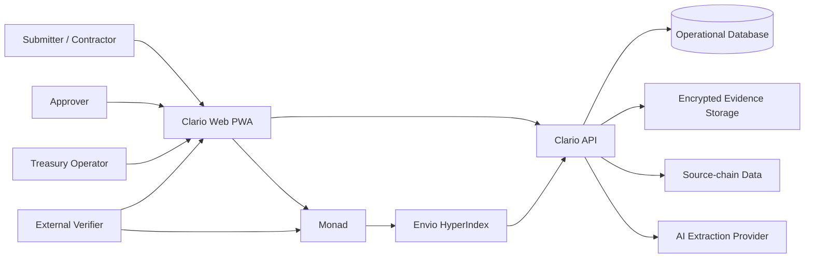
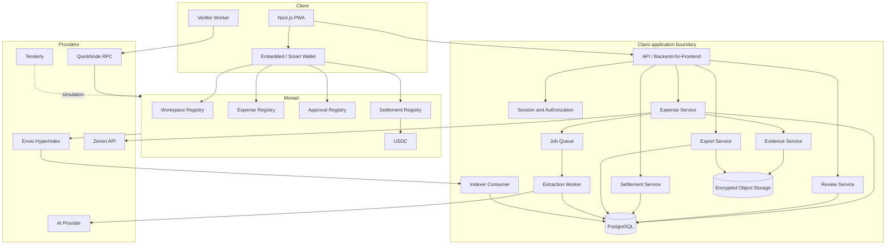
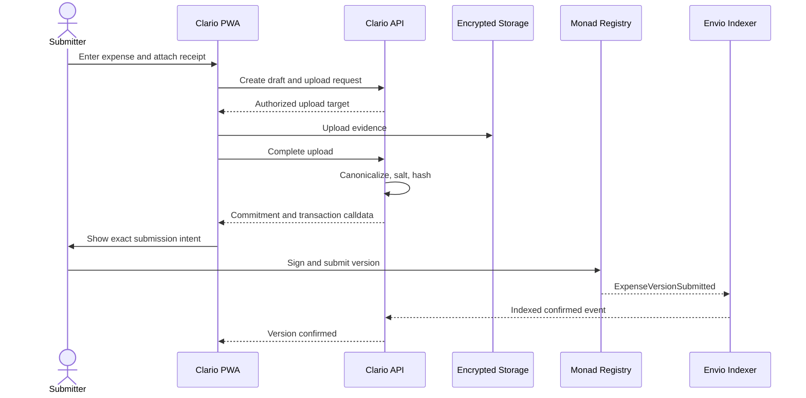
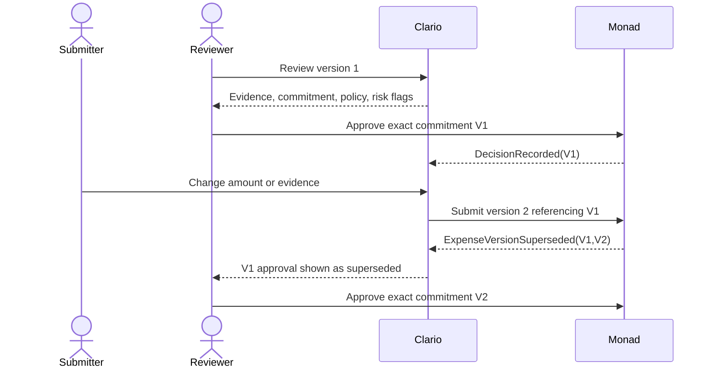
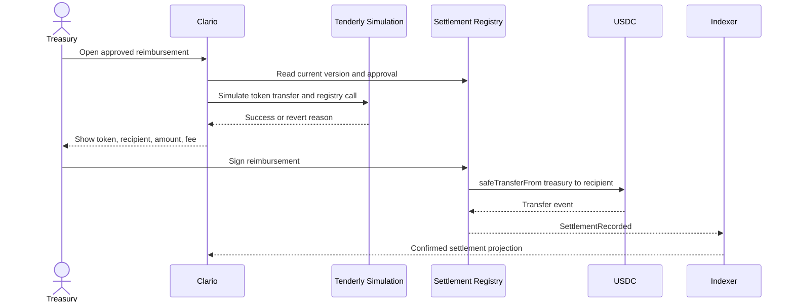

# Clario — System Architecture

**Document status:** Founding architecture and hackathon implementation specification  
**Version:** 1.0  
**Primary network:** Monad  
**Companion document:** [Product Requirements Document](./prd.md)  
**Resource baseline:** [Metropolis Hackathon Resources](https://hackathon.monad.xyz/resources) and [Metropolis Tracks](https://hackathon.monad.xyz/tracks)  

---

## 1. Purpose

This document defines how Clario is built from scratch as a secure, verifiable expense workflow for crypto teams. It translates the product requirements into system boundaries, deployable components, smart contracts, storage rules, data formats, interfaces, failure behavior, and an implementation sequence.

Clario connects six facts that are normally fragmented:

1. A payment or invoice exists.
2. A submitter explains its business purpose.
3. Private evidence supports the explanation.
4. An authorized person reviews one exact version.
5. Corrections preserve history and invalidate stale approval.
6. Reimbursement is connected to the approved version.

Monad is Clario's shared integrity and settlement layer. Sensitive business data stays encrypted offchain. Onchain records establish ordering, commitments, authority, decisions, supersession, and payment references.

This architecture is optimized for a credible hackathon MVP and a safe path to production. It does not pretend that every resource in the Metropolis catalog belongs in the runtime. Every resource category is evaluated in the resource traceability section; only resources that strengthen Clario's core workflow become dependencies.

---

## 2. Architecture goals

### 2.1 Functional goals

- Support team workspaces with scoped roles.
- Import a transaction or create a manual expense.
- Store receipts, invoices, and notes privately.
- Commit immutable expense versions to Monad.
- Bind approval to one exact version and reviewer authority.
- Invalidate current approval after a material edit.
- Reimburse an approved claim in supported USDC on Monad.
- Reconstruct the workflow from indexed events.
- Export a package that can be independently verified.
- Use AI for extraction and warnings while keeping humans in control.

### 2.2 Quality goals

- No private expense content onchain.
- No silent overwrite of a submitted version.
- No valid approval for a different version, workspace, contract, or chain.
- No normal duplicate reimbursement.
- No dependency on Clario's private database for package verification.
- Clear recovery from rejected, failed, replaced, and delayed transactions.
- Provider failures degrade to manual workflows instead of corrupting state.
- A focused three-minute demonstration remains possible even when optional integrations are unavailable.

### 2.3 Constraints

- The hackathon network and supported assets must be confirmed from current Metropolis instructions.
- Monad mainnet and testnet configuration must never be mixed.
- Large files and personal data cannot be stored on a public blockchain.
- Source-chain transaction data may come from a provider and is not made trustless merely by hashing its transaction ID on Monad.
- AI output is advisory and must be confirmed before commitment.
- One wallet architecture and one primary indexer are selected for the MVP.

---

## 3. System context



### 3.1 Trust boundaries

| Boundary | Data crossing it | Required control |
|---|---|---|
| Browser ↔ API | Sessions, expense fields, encrypted or upload content | TLS, session validation, workspace authorization, rate limits |
| Browser ↔ wallet | Typed signatures and Monad transactions | Chain validation, intent preview, domain separation, transaction simulation |
| API ↔ object storage | Encrypted evidence | Envelope encryption, short-lived signed URLs, object-level authorization |
| API ↔ database | Workflow and private metadata | Encryption at rest, least-privilege credentials, row/workspace checks |
| API ↔ AI provider | Receipt data selected for extraction | Explicit consent/configuration, data minimization, provider policy, timeout and fallback |
| API ↔ source-chain provider | Address and transaction queries | Provider attribution, validation, caching, fallback |
| Monad ↔ indexer | Public contract events | Idempotent processing, block/log identity, reorganization handling |
| Verifier ↔ export | Manifest, salts, disclosed records and evidence | Local hashing, schema validation, no implicit trust in export claims |

---

## 4. Chosen technology stack

| Layer | MVP choice | Reason |
|---|---|---|
| Web application | Next.js PWA with TypeScript | Responsive installable web product and compatibility with official Monad wallet templates |
| UI state | Server state cache plus local form state | Separates remote workflow truth from incomplete drafts |
| Wallet | Privy smart wallet path | Familiar onboarding and sponsored low-value interactions |
| Contract client | Viem | Typed reads, writes, signatures, receipt polling, and chain configuration |
| Primary RPC | QuickNode Monad endpoint | Metropolis participant plan and production-grade RPC path |
| Smart contracts | Solidity + OpenZeppelin | EVM compatibility and established authorization/signature primitives |
| Contract tooling | Foundry preferred; Hardhat acceptable | Fast tests, fuzzing, deployment, and official Monad support |
| Event indexing | Envio HyperIndex | Custom projections for versions, decisions, roles, and settlements |
| Transaction import | Zerion API plus RPC fallback | Multichain wallet activity and Metropolis Builder-tier perk |
| Simulation/debugging | Tenderly | Preflight, traces, monitoring, and participant Pro-tier perk |
| Private database | PostgreSQL | Transactions, constraints, JSON support, and reliable reporting |
| Evidence storage | S3-compatible private object storage | Encrypted binary storage with lifecycle and access controls |
| Encryption | AES-256-GCM envelope encryption with managed KEK | Authenticated encryption and separable key rotation |
| AI | Provider abstraction | Receipt extraction can change provider without changing the committed schema |
| Reimbursement | Supported USDC contract on Monad | Stable denomination and a verifiable payment path |
| Observability | Structured logs, traces, metrics, error tracking | Diagnose cross-provider and transaction lifecycle failures |

### 4.1 Approved alternatives

Alchemy Smart Wallets, RPC, webhooks, gas sponsorship, and EIP-7702 support may replace Privy plus QuickNode if the team selects the Alchemy bounty. Both account systems must not be shipped together in the MVP.

GhostGraph or QuickNode Streams may replace Envio if Envio is unavailable. The event schema remains provider-neutral.

Circle Wallets may replace the wallet layer if its Monad onboarding and gas sponsorship provide a materially better end-to-end USDC workflow. Circle's canonical USDC contracts may be used without adopting Circle Wallets.

---

## 5. Container architecture



### 5.1 Deployment choice

The hackathon MVP may deploy the API, background jobs, and Next.js application together when supported by the hosting platform. Logical service boundaries remain separate modules even if they share one runtime. AI extraction and event ingestion must be safe to execute asynchronously and repeatedly.

Production should separate latency-sensitive API traffic, event ingestion, document processing, and long-running exports into independently scalable workloads.

---

## 6. Onchain architecture

### 6.1 Contract design

The preferred production design uses four contracts. For hackathon delivery they may be modules behind one `ClarioRegistry` contract, provided public interfaces and events remain separated.

#### WorkspaceRegistry

Responsibilities:

- Register opaque workspace identifiers.
- Identify owner/admin authority.
- Grant and revoke scoped roles.
- Version workspace approval policy.
- Answer whether a wallet was authorized for a role at a relevant block or policy version.

Roles:

- `OWNER_ROLE`
- `ADMIN_ROLE`
- `APPROVER_ROLE`
- `TREASURY_ROLE`
- `AUDITOR_ROLE`

Submitter permission may be application-managed for the MVP; any action carrying public authority must be contract-enforced.

#### ExpenseRegistry

Responsibilities:

- Register a new immutable expense commitment.
- Enforce monotonically increasing versions.
- Bind the record to a workspace and submitter.
- Link a version to its predecessor.
- Mark the previous current version as superseded.
- Expose current-version lookup.

#### ApprovalRegistry

Responsibilities:

- Record `APPROVE`, `REJECT`, or `REQUEST_CHANGES` for an exact commitment.
- Verify role authority.
- Prevent signature replay.
- Expose whether current approval is valid.
- Preserve historical decisions after supersession.

#### SettlementRegistry

Responsibilities:

- Accept only an approved current version.
- Bind intended token, recipient, and amount to the approved commitment.
- Record or execute a reimbursement.
- Prevent duplicate normal settlement.
- Expose settlement state for verification.

The safest MVP transfers USDC through the settlement contract using `safeTransferFrom`, so the contract can atomically bind the payment to an approved claim. If treasury UX requires an external wallet transfer, Clario records the transaction reference and verifies its token transfer log before marking settlement complete.

### 6.2 Contract identifiers

- `workspaceId`: `bytes32` derived from an application UUID plus a domain.
- `expenseId`: random `bytes32`, never derived from private content.
- `version`: `uint32`, starting at 1.
- `commitment`: `bytes32` hash of the canonical private record and random salt.
- `policyVersion`: `uint32` identifying the authorization policy used.
- `decisionId`: derived from workspace, expense, version, signer, decision nonce, and domain.

Identifiers must not contain emails, names, invoice numbers, or other guessable private values.

### 6.3 Contract interface

```solidity
interface IClarioRegistry {
    enum Decision { None, Approve, Reject, RequestChanges }

    function createWorkspace(
        bytes32 workspaceId,
        bytes32 policyCommitment
    ) external;

    function grantRole(
        bytes32 workspaceId,
        address account,
        bytes32 role,
        bytes32 scope
    ) external;

    function revokeRole(
        bytes32 workspaceId,
        address account,
        bytes32 role,
        bytes32 scope
    ) external;

    function submitVersion(
        bytes32 workspaceId,
        bytes32 expenseId,
        uint32 version,
        bytes32 commitment,
        bytes32 previousCommitment
    ) external;

    function recordDecision(
        bytes32 workspaceId,
        bytes32 expenseId,
        uint32 version,
        bytes32 commitment,
        Decision decision,
        bytes32 reasonCommitment
    ) external;

    function reimburse(
        bytes32 workspaceId,
        bytes32 expenseId,
        uint32 version,
        bytes32 commitment,
        address token,
        address recipient,
        uint256 amount
    ) external;

    function isApprovalValid(
        bytes32 workspaceId,
        bytes32 expenseId,
        uint32 version
    ) external view returns (bool);
}
```

The final implementation may split interfaces, but it must preserve these invariants.

### 6.4 Events

```solidity
event WorkspaceCreated(bytes32 indexed workspaceId, address indexed owner, bytes32 policyCommitment);
event RoleGranted(bytes32 indexed workspaceId, address indexed account, bytes32 indexed role, bytes32 scope);
event RoleRevoked(bytes32 indexed workspaceId, address indexed account, bytes32 indexed role, bytes32 scope);
event PolicyUpdated(bytes32 indexed workspaceId, uint32 policyVersion, bytes32 policyCommitment);
event ExpenseVersionSubmitted(bytes32 indexed workspaceId, bytes32 indexed expenseId, uint32 indexed version, bytes32 commitment, address submitter);
event ExpenseVersionSuperseded(bytes32 indexed workspaceId, bytes32 indexed expenseId, uint32 oldVersion, uint32 newVersion);
event DecisionRecorded(bytes32 indexed workspaceId, bytes32 indexed expenseId, uint32 indexed version, bytes32 commitment, address reviewer, uint8 decision, bytes32 reasonCommitment);
event SettlementRecorded(bytes32 indexed workspaceId, bytes32 indexed expenseId, uint32 indexed version, bytes32 commitment, address token, address recipient, uint256 amount, bytes32 paymentReference);
```

No event may contain a merchant name, purpose, receipt URL, email, category label, invoice identifier, or plaintext note.

### 6.5 Contract invariants

1. A version number for an expense cannot be reused.
2. Version `n` must reference the registered commitment of version `n-1`.
3. Only the current version may be newly approved or reimbursed.
4. A decision is valid only for the exact submitted commitment.
5. The reviewer must have valid authority under the applicable workspace policy.
6. A material edit always produces a new version.
7. A superseded approval remains historical but cannot authorize settlement.
8. A version cannot be reimbursed twice through the standard settlement path.
9. Settlement token, recipient, and amount must equal the approved private instruction commitment or disclosed settlement fields.
10. Pausing new writes cannot erase or change historical reads.

### 6.6 Upgradeability

For the hackathon, prefer non-upgradeable contracts with versioned deployment addresses. This reduces admin-key risk and makes verifier behavior clear. Schema evolution occurs through `schemaVersion` in commitments and a new registry deployment when contract behavior changes.

If production requires upgradeability, use a timelocked, multisig-controlled proxy with published implementation changes and explicit verifier support for each version. Upgradeability is not part of the MVP.

---

## 7. Commitment and canonicalization protocol

### 7.1 Canonical private record

The application creates a deterministic byte representation using a published schema. JSON must not be hashed using arbitrary runtime serialization.

Required normalization rules:

- Fixed UTF-8 encoding.
- Stable field order.
- Unicode normalization.
- Checksummed addresses converted to 20-byte binary before encoding.
- Chain IDs encoded as integers.
- Token amounts encoded in base units.
- ISO-8601 UTC timestamps with defined precision.
- Absent optional values encoded consistently.
- Evidence sorted by stable evidence ID.
- No locale-dependent numbers or dates.

Recommended commitment:

```text
privateRecordHash = keccak256(canonicalExpenseBytes)
evidenceManifestHash = keccak256(canonicalEvidenceManifestBytes)

commitment = keccak256(abi.encode(
  CLARIO_EXPENSE_V1_DOMAIN,
  monadChainId,
  registryAddress,
  workspaceId,
  expenseId,
  version,
  privateRecordHash,
  evidenceManifestHash,
  random32ByteSalt
))
```

The salt is generated with a cryptographically secure random source and stored separately from public chain data. Predictable salts are prohibited.

### 7.2 Evidence manifest

The manifest is inspired by the C2PA model of portable provenance. It records:

- Manifest schema version
- Evidence ID
- MIME type and size
- Plaintext content hash
- Ciphertext content hash
- Capture/import source when disclosed
- Transformation history, such as rotation, compression, OCR, or redaction
- Actor or service responsible for each transformation
- Timestamp
- Previous manifest hash

This is C2PA-inspired in the MVP, not a claim of full C2PA conformance. A later release may emit conforming Content Credentials.

### 7.3 Approval typed data

If offchain EIP-712 signatures are used before relaying, the signed structure includes:

- Name: `ClarioApproval`
- Version
- Monad chain ID
- Verifying contract
- Workspace ID
- Expense ID
- Expense version
- Exact commitment
- Decision
- Reason commitment
- Policy version
- Signer nonce
- Expiration

Direct contract calls remain authoritative. Relayed signatures must be consumed once and be invalid across other domains.

---

## 8. Private data and key architecture

### 8.1 Data classification

| Class | Examples | Storage |
|---|---|---|
| Public-verifiable | Opaque IDs, commitments, role addresses, decisions, settlement references | Monad and indexer |
| Workspace-confidential | Purpose, merchant, categories, reports, AI results | Encrypted database fields |
| Evidence-confidential | Receipts, invoices, contracts | Encrypted object storage |
| Security-sensitive | Session secrets, provider keys, key references | Secret manager |
| Public-operational | Contract ABI, addresses, schema versions, verifier code | Repository and deployment manifest |

### 8.2 Envelope encryption

1. Generate a random data-encryption key per evidence object or expense version.
2. Encrypt content with AES-256-GCM using a unique nonce.
3. Bind workspace, expense, version, and evidence ID as authenticated additional data.
4. Encrypt the data key with a key-encryption key managed outside the database.
5. Store ciphertext in private object storage and the wrapped key reference in the database.
6. Return evidence only after server-side workspace and record authorization.

Hackathon deployments may use a managed key service. A plain environment variable shared as the only encryption key is not production-ready and must be labeled if used temporarily.

### 8.3 Access rules

- Submitters can read their own records and evidence unless workspace policy narrows access.
- Approvers can read records assigned within their approval scope.
- Treasury can see settlement fields and only the evidence required by policy.
- Auditors receive read-only, time-bound access or a deliberately disclosed export.
- Administrators cannot bypass evidence authorization merely because they can manage membership unless policy explicitly grants that role.
- Revocation stops future reads but does not change already disclosed exports.

### 8.4 Deletion and retention

Onchain commitments cannot be deleted. Offchain private data follows workspace retention rules. Deletion removes ciphertext and wrapped keys, leaving an opaque public commitment that reveals no plaintext. Exports are outside Clario's control after the user downloads them; the UI must explain this before export.

---

## 9. Operational data model

Core relational tables:

- `users`
- `wallet_identities`
- `workspaces`
- `memberships`
- `role_grants`
- `workspace_policies`
- `expenses`
- `expense_versions`
- `evidence_objects`
- `source_transactions`
- `ai_analyses`
- `review_assignments`
- `decisions`
- `reimbursements`
- `chain_transactions`
- `indexed_events`
- `audit_events`
- `exports`
- `idempotency_keys`

### 9.1 Key constraints

- Unique `(workspace_id, expense_id, version)`.
- Unique `(workspace_id, source_chain_id, source_transaction_hash, claim_slot)` where applicable.
- Unique chain event `(chain_id, transaction_hash, log_index)`.
- Unique active reimbursement per `(expense_id, version)`.
- A decision references an existing immutable expense version.
- Evidence references exactly one version once submitted.
- Current version on `expenses` must exist in `expense_versions`.
- Database status projections can be rebuilt from onchain events plus private workflow events.

### 9.2 State ownership

| State | Authority |
|---|---|
| Draft contents | Clario database |
| Private evidence bytes | Encrypted object store |
| Submitted version commitment | Monad |
| Reviewer authority | Monad role/policy history |
| Approval/rejection | Monad |
| Current public version | Monad |
| Search/filter projection | Database/indexer |
| AI suggestions | Database, advisory only |
| Reimbursement confirmation | Monad token and registry events |
| Export verification result | Deterministic verifier calculation |

---

## 10. API architecture

All private endpoints require an authenticated session and workspace authorization. Mutations accept an idempotency key.

### 10.1 Workspace API

- `POST /api/workspaces`
- `GET /api/workspaces/:workspaceId`
- `POST /api/workspaces/:workspaceId/invitations`
- `POST /api/workspaces/:workspaceId/roles/prepare`
- `GET /api/workspaces/:workspaceId/members`

The `prepare` endpoint returns transaction calldata or typed data; it never signs for the user.

### 10.2 Expense API

- `GET /api/workspaces/:workspaceId/expenses`
- `POST /api/workspaces/:workspaceId/expenses`
- `GET /api/expenses/:expenseId`
- `POST /api/expenses/:expenseId/versions`
- `POST /api/expenses/:expenseId/submit/prepare`
- `GET /api/expenses/:expenseId/timeline`
- `GET /api/expenses/:expenseId/diff?from=1&to=2`

### 10.3 Evidence API

- `POST /api/expenses/:expenseId/evidence/uploads`
- `POST /api/evidence/:evidenceId/complete`
- `GET /api/evidence/:evidenceId/download`
- `DELETE /api/evidence/:evidenceId` for drafts only

Submitted evidence is never overwritten. Replacement creates a new version.

### 10.4 Review API

- `GET /api/reviews/queue`
- `GET /api/expenses/:expenseId/review`
- `POST /api/expenses/:expenseId/decisions/prepare`
- `POST /api/chain-transactions/:transactionId/acknowledge`

### 10.5 Reimbursement API

- `GET /api/reimbursements/queue`
- `POST /api/expenses/:expenseId/reimbursements/prepare`
- `GET /api/reimbursements/:reimbursementId`

The server rechecks current version, approval validity, role, token, amount, recipient, and prior settlement immediately before returning transaction data.

### 10.6 Import, AI, and export API

- `GET /api/import/transactions?chainId=&address=&cursor=`
- `POST /api/expenses/:expenseId/extract`
- `GET /api/jobs/:jobId`
- `POST /api/reports/exports`
- `GET /api/exports/:exportId`
- `POST /api/verifier/check` for convenience; local verification remains available

### 10.7 Error contract

Errors return:

```json
{
  "error": {
    "code": "EXPENSE_VERSION_SUPERSEDED",
    "message": "This expense changed after you opened it. Review version 2 before approving.",
    "requestId": "opaque-id",
    "retryable": false
  }
}
```

Messages must guide the user without exposing private data or infrastructure secrets.

---

## 11. Critical workflows

### 11.1 Submit an expense



The server must never claim submission is final before the expected event is confirmed.

### 11.2 Approve and invalidate



The application rechecks the current onchain version before preparing and before broadcasting a decision.

### 11.3 Reimburse



### 11.4 Verify export

1. Parse the export manifest and require a supported schema version.
2. Recalculate every disclosed record and evidence hash.
3. Rebuild the expense commitment using the disclosed salt.
4. Query Monad for version, predecessor, supersession, and decisions.
5. Rebuild reviewer authority at decision time.
6. Confirm the active version and current approval validity.
7. Query the USDC transfer and settlement event.
8. Compare token, sender, recipient, amount, and version.
9. Produce `VERIFIED`, `VERIFIED_WITH_WARNINGS`, `FAILED`, or `UNVERIFIABLE` per check and overall.

Verification proves record integrity, signer authority, sequence, and matching settlement. It does not prove that a receipt is genuine, the business purpose is legitimate, or the expense is tax compliant.

---

## 12. Event indexing

### 12.1 Envio projections

- `Workspace`
- `RoleGrant`
- `PolicyVersion`
- `ExpensePublicState`
- `ExpenseVersionPublicState`
- `DecisionPublicState`
- `SettlementPublicState`
- `ActorActivity`

### 12.2 Processing rules

- Key events by chain ID, block hash, transaction hash, and log index.
- Processing is idempotent.
- Preserve block number and confirmation/finality state.
- Remove or reverse projections after a detected reorganization.
- Do not enrich public indexer entities with private Clario fields.
- API joins public projections with private records only after authorization.
- If Envio lags, direct RPC reads validate critical approval and settlement actions.

### 12.3 QuickNode usage

QuickNode provides primary Monad JSON-RPC. Streams or webhooks may supply rapid transaction notifications, but Envio remains the canonical query projection in the chosen MVP stack. Provider URLs and keys remain server-side where possible.

---

## 13. Transaction lifecycle

Every user transaction follows:

```text
PREPARING → AWAITING_SIGNATURE → SUBMITTED → CONFIRMING → CONFIRMED
                  │                  │            │
                  └→ REJECTED        ├→ REPLACED  ├→ REORGED
                                     └→ FAILED    └→ FAILED
```

Rules:

- Store transaction intent before asking for a signature.
- Validate `eth_chainId` before every write.
- Simulate financially meaningful writes.
- Save transaction hash immediately after broadcast.
- Derive business completion from expected confirmed events, not receipt success alone.
- Allow safe retry only when idempotency and onchain state prove the action did not complete.
- Never ask a user to sign an opaque retry while the previous transaction is unresolved.

Monad-specific behavior must follow:

- [Differences from Ethereum](https://docs.monad.xyz/developer-essentials/differences)
- [Gas pricing](https://docs.monad.xyz/developer-essentials/gas-pricing)
- [Reserve balance](https://docs.monad.xyz/developer-essentials/reserve-balance)
- [EIP-7702](https://docs.monad.xyz/developer-essentials/eip-7702) when used
- [JSON-RPC API](https://docs.monad.xyz/reference/json-rpc/api)

---

## 14. AI architecture

### 14.1 Pipeline

```text
authorized evidence access
  → safe text/image extraction
  → untrusted-document isolation
  → structured model request
  → schema validation
  → confidence and anomaly rules
  → human confirmation
  → committed expense version
```

### 14.2 Output schema

- Merchant
- Document date
- Invoice/receipt number
- Currency
- Subtotal
- Tax
- Total
- Suggested category
- Suggested project
- Candidate transaction matches
- Duplicate likelihood
- Amount/date mismatch flags
- Field-level confidence
- Model and prompt version

### 14.3 Safety rules

- Treat receipt text as untrusted data, never as instructions.
- Do not include secrets or unrelated workspace history in prompts.
- Validate structured output against a strict schema.
- Require human confirmation before commitment.
- Record corrections for evaluation, not automatic authority.
- Make manual submission available during provider failure.
- Never permit the model to approve, sign, transfer, change roles, or reveal evidence.

### 14.4 Agent extensions

[x402 on Monad](https://docs.monad.xyz/guides/x402#what-is-x402) can later meter a verification API. [ERC-8004](https://docs.monad.xyz/guides/erc-8004) and [Trust8004](https://www.8004.org/build) can identify and score third-party verifier agents. These are post-MVP modules and do not grant agents treasury authority.

---

## 15. Verification package architecture

### 15.1 Package layout

```text
clario-export/
  manifest.json
  workspace-policy.json
  expenses/
    <expense-id>/
      v1/record.json
      v1/salt.bin
      v1/evidence-manifest.json
      v2/record.json
      v2/salt.bin
      v2/evidence-manifest.json
  evidence/
    <evidence-id>.<extension>
  chain/
    deployment-manifest.json
    expected-events.json
  verification-result.json
```

Private exports are deliberately disclosed by an authorized user. A redacted export omits private record/evidence material and reports affected checks as unavailable.

### 15.2 Manifest fields

- Export schema version
- Generator version
- Creation timestamp
- Monad chain ID
- Registry addresses and ABI hashes
- Workspace identifier
- Included expense/version list
- File path, size, media type, and hash list
- Disclosure level
- Canonicalization specification URL/version
- Optional exporter signature

### 15.3 Verifier implementation

The verifier should run in a Web Worker or standalone CLI/library. Core verification logic must be open source, deterministic, free of authenticated Clario APIs, and able to use any compatible Monad RPC endpoint.

The C2PA [Content Credentials specification](https://spec.c2pa.org) informs manifest provenance and transformation history. Clario must repeat the standard's practical lesson: provenance can establish integrity without establishing truth.

---

## 16. Security architecture

### 16.1 Primary threats and controls

| Threat | Control |
|---|---|
| Unsalted dictionary attack against private fields | Random 32-byte salt inside version commitment |
| Receipt exposed through public URL | Private bucket and short-lived authorized download |
| Broken object authorization | Workspace, role, scope, and record checks on every request |
| Approval replay | Chain/contract domain, exact commitment, nonce, expiration |
| Approval survives edit | Immutable versions and current-version contract check |
| Reviewer role revoked | Authority check against current/applicable policy history |
| Duplicate reimbursement | Database idempotency plus contract-level settlement guard |
| Recipient substitution | Approved settlement commitment, user preview, simulation, event validation |
| Malicious upload | Size/type checks, parser isolation, malware scanning, no executable serving |
| Prompt injection in receipt | Treat content as data; fixed tool-free extraction prompt and schema validation |
| Secret leakage | Secret manager, log redaction, scoped provider keys |
| Indexer lies or lags | Direct RPC confirmation for critical reads |
| RPC provider fails | Health-aware fallback and user-safe retry |
| Admin key compromise | Minimal powers, multisig for production, pause limited to new writes |

### 16.2 Authentication and session security

- Verify wallet signatures server-side with nonce, domain, expiration, and audience.
- Rotate session identifiers after authentication and privilege change.
- Use secure, HTTP-only, same-site cookies for browser sessions.
- Require recent wallet confirmation for role changes, exports, and treasury actions.
- Apply CSRF protection to cookie-authenticated mutations.
- Do not treat a client-supplied wallet address as authenticated identity.

### 16.3 Smart contract controls

- OpenZeppelin role and token utilities.
- Checks-effects-interactions and reentrancy protection where payment occurs.
- Safe ERC-20 transfer handling.
- Pause only new submissions/decisions/settlements during emergencies.
- Property and invariant tests.
- Tenderly simulation for high-impact paths.
- Verified source and immutable deployment manifest.

### 16.4 Privacy architecture references

[Vana](https://docs.vana.org) informs grant-gated encrypted data access. [Ocean compute-to-data examples](https://github.com/deltaDAO/Ocean-Protocol-Use-Cases) inform a future design in which analysis runs near evidence without copying raw documents. Neither becomes a runtime dependency in the MVP.

---

## 17. Reliability and observability

### 17.1 Service-level targets after hackathon

- Read API availability: 99.9%
- Write API availability: 99.5%
- Confirmed indexer lag: less than 5 seconds at p95 under normal conditions
- Evidence retrieval: less than 2 seconds at p95 excluding very large files
- Recovery point objective: 15 minutes for private operational data
- Recovery time objective: 4 hours

### 17.2 Telemetry

- Request success, latency, and error code
- Background job attempts and terminal state
- RPC health and method latency
- Submitted-to-confirmed duration
- Envio indexed block and lag
- Evidence upload/download failures
- AI extraction latency, schema failure, and confidence distribution
- Reimbursement preparation, simulation, and confirmation failures
- Verifier check outcomes

Telemetry must not contain private purpose text, merchant names, evidence bytes, email addresses, encryption material, full AI prompts, or salts.

### 17.3 Recovery

- PostgreSQL point-in-time recovery.
- Versioned object storage with tested deletion policy.
- Rebuildable onchain projections.
- Dead-letter queue for repeatedly failed jobs.
- Admin recovery tools that show the intended action and preserve an audit event.
- Provider configuration switch without changing data schemas.

---

## 18. Environments and deployment

### 18.1 Environments

| Environment | Purpose | Chain |
|---|---|---|
| Local | Unit/integration development | Local EVM plus mocked providers |
| Preview | Feature review | Hackathon-approved Monad test network |
| Staging | End-to-end rehearsal | Same network family and contracts as final rehearsal |
| Production/demo | Public submission | Network required by current Metropolis rules |

### 18.2 Configuration

- `APP_ENV`
- `CHAIN_FAMILY`
- `MONAD_CHAIN_ID`
- `MONAD_RPC_URL`
- `MONAD_RPC_FALLBACK_URL`
- `MONAD_EXPLORER_URL`
- `SOURCE_COMMIT`
- `DEPLOYMENT_MANIFEST_JSON`
- `ENVIO_GRAPHQL_URL`
- Provider credentials
- Database connection
- Object storage bucket/region
- Key-management identifiers
- AI provider/model configuration

No contract address or chain ID is silently inferred from hostname. Contract and token addresses are not accepted as independent runtime variables; the deployment manifest is their canonical mapping. Server validation produces the explicitly safe public configuration rather than exposing raw environment variables to the browser.

### 18.3 Deployment manifest

```json
{
  "schemaVersion": 1,
  "environment": "<local|preview|staging|production>",
  "sourceCommit": "<SOURCE_COMMIT>",
  "chainFamily": "<local|monad>",
  "chainId": "<CHAIN_ID_INTEGER>",
  "deployer": "<DEPLOYER_ADDRESS>",
  "deployedAt": "<ISO_8601_TIMESTAMP>",
  "contracts": {
    "ClarioRegistry": {
      "address": "<CLARIO_REGISTRY_ADDRESS>",
      "deploymentBlock": "<DEPLOYMENT_BLOCK_INTEGER>",
      "transactionHash": "<DEPLOYMENT_TRANSACTION_HASH>",
      "abiHash": "<ABI_HASH>",
      "verifiedSourceUrl": "<VERIFIED_SOURCE_URL_OR_NULL>"
    }
  },
  "tokens": {
    "USDC": {
      "address": "<USDC_ADDRESS>",
      "decimals": "<USDC_DECIMALS_INTEGER>"
    }
  }
}
```

The snippet describes shape only and is not a valid runtime manifest. Placeholder values are replaced from actual deployment receipts and verified issuer data by authorized deployment automation. Runtime configuration rejects direct contract/token address variables and accepts addresses only through a manifest whose environment, chain family, chain ID, and source commit match process intent. Current chain and token addresses must come from official Monad and issuer documentation.

### 18.4 Release gate

- Contracts deployed through the official [deployment guide](https://docs.monad.xyz/guides/deploy-smart-contract/index).
- Contracts verified through the official [verification guide](https://docs.monad.xyz/guides/verify-smart-contract/index).
- Deployment manifest matches runtime configuration.
- Critical contract invariants pass.
- Full role-separated demo passes.
- Valid and tampered exports produce expected verifier results.
- Private-data leakage scan passes for events, calldata, logs, analytics, and URLs.
- Sponsor SDK versions and bounty requirements are recorded.

---

## 19. Testing architecture

### 19.1 Contracts

- Unit tests for every permission and state transition.
- Fuzz tests for IDs, versions, nonces, amounts, and role scopes.
- Invariant: settlement implies approval of the same current commitment.
- Invariant: no expense version has more than one active standard settlement.
- Invariant: supersession prevents old approval from authorizing payment.
- Malicious ERC-20 and reentrancy tests when transfers occur in-contract.
- Fork tests only where the selected network and contracts support them.

### 19.2 Canonicalization and cryptography

- Golden vectors shared across server, browser, and verifier.
- Unicode, null, optional-field, timestamp, decimal, and evidence-order cases.
- Salt uniqueness and entropy checks.
- Tampered record/evidence/manifest detection.
- Typed-signature domain and replay tests.

### 19.3 Application

- Workspace data isolation.
- Role and scope enforcement.
- Upload authorization and object-key guessing.
- Idempotent mutations.
- Provider timeout and fallback.
- Transaction replacement and reorganization.
- AI malformed output and prompt-injection fixtures.
- Accessibility tests for core forms, dialogs, status, and errors.

### 19.4 End-to-end release test

Use distinct submitter, approver, and treasury identities:

1. Create workspace and roles.
2. Import a source payment through Zerion or RPC fallback.
3. Upload a private receipt.
4. Confirm extracted fields.
5. Submit version 1 on Monad.
6. Approve version 1.
7. Change the amount and evidence, creating version 2.
8. Confirm version 1 approval is superseded.
9. Approve version 2.
10. Reimburse version 2 in USDC.
11. Export and verify successfully.
12. Tamper with one file and verify failure.

---

## 20. Implementation roadmap

### Phase A — protocol foundation

- Lock canonical expense schema.
- Build golden commitment vectors.
- Implement registry contract and invariants.
- Configure Monad deployment and verification.
- Publish ABI and event definitions.

### Phase B — private workflow

- Implement authentication and workspace authorization.
- Add PostgreSQL schema and migrations.
- Add encrypted evidence storage.
- Create/import expense drafts.
- Prepare and track version transactions.

### Phase C — approval integrity

- Add review queue and private evidence view.
- Implement exact-version decisions.
- Implement version diff and supersession.
- Add Envio projections and activity timeline.

### Phase D — settlement and verification

- Integrate supported Monad USDC.
- Simulate and execute reimbursement.
- Add duplicate-settlement guards.
- Generate portable packages.
- Release standalone verifier.

### Phase E — intelligence and polish

- Add AI extraction and confidence display.
- Add duplicate and mismatch warnings.
- Sponsor commitment/approval gas.
- Add error recovery, accessibility, responsive UX, and observability.
- Rehearse the complete demo with live providers.

---

## 21. Metropolis resource traceability

Every section in the supplied resource catalog is accounted for below. `BUILD` means a runtime or delivery dependency. `REFERENCE` means its architecture or security lesson is applied. `ALTERNATIVE` means it can replace a selected component. `FUTURE` means it maps to a documented upgrade. `OUT OF SCOPE` means it does not serve the Clario product thesis.

### 21.1 Sponsor perks

| Resource | Disposition | Use |
|---|---|---|
| [QuickNode Build Plan](https://www.quicknode.com/) | BUILD | Primary Monad RPC; optional Streams/webhooks |
| [Tenderly Pro](https://tenderly.co/) | BUILD | Simulation, traces, debugging, monitoring |
| [Zerion API Builder](https://zerion.io/api/) | BUILD | Multichain wallet activity ingestion |

Claim links and perk values are maintained in the PRD because they are operational rather than architectural.

### 21.2 Monad documentation

| Resource group | Disposition | Architectural use |
|---|---|---|
| [Developer essentials](https://docs.monad.xyz/developer-essentials/summary) | BUILD | Chain behavior and deployment checklist |
| [Differences from Ethereum](https://docs.monad.xyz/developer-essentials/differences) | BUILD | Compatibility review and test cases |
| [Gas pricing](https://docs.monad.xyz/developer-essentials/gas-pricing) | BUILD | Fee estimation |
| [Opcode pricing](https://docs.monad.xyz/developer-essentials/opcode-pricing) | REFERENCE | Contract gas review |
| [Precompiles](https://docs.monad.xyz/developer-essentials/precompiles) | REFERENCE | Evaluate supported cryptographic primitives |
| [Reserve balance](https://docs.monad.xyz/developer-essentials/reserve-balance) | BUILD | Preflight available-balance checks |
| [EIP-7702](https://docs.monad.xyz/developer-essentials/eip-7702) | ALTERNATIVE | Smart-account delegation path |
| [Staking](https://docs.monad.xyz/reference/staking/overview) | OUT OF SCOPE | No staking in expense MVP |
| [Tooling and infra](https://docs.monad.xyz/tooling-and-infra) | BUILD | Provider compatibility source |
| [Deploy contracts](https://docs.monad.xyz/guides/deploy-smart-contract/index) | BUILD | Deployment procedure |
| [Verify contracts](https://docs.monad.xyz/guides/verify-smart-contract/index) | BUILD | Source verification |
| [Indexers](https://docs.monad.xyz/guides/indexers/index) | BUILD | Event projection design |
| [x402](https://docs.monad.xyz/guides/x402#what-is-x402) | FUTURE | Paid verifier API |
| [ERC-8004](https://docs.monad.xyz/guides/erc-8004) | FUTURE | Verifier-agent identity |
| [MERA](https://docs.monad.xyz/guides/mera) | FUTURE | Evaluate passkey/runtime opportunity against current bounty requirements |

### 21.3 Starter templates

| Template family | Disposition | Decision |
|---|---|---|
| [Privy embedded-wallet PWA](https://docs.monad.xyz/templates/next-serwist-privy-embedded-wallet) | ALTERNATIVE | Use if EOA-style embedded wallet is simpler |
| [Privy smart-wallet PWA](https://docs.monad.xyz/templates/next-serwist-privy-smart-wallet) | BUILD | Preferred onboarding reference |
| [0x + Privy PWA](https://docs.monad.xyz/templates/next-serwist-0x-privy-embedded-wallet) | FUTURE | Treasury asset conversion only |
| [thirdweb PWA](https://docs.monad.xyz/templates/next-serwist-thirdweb) | ALTERNATIVE | Wallet-provider fallback |
| [Farcaster miniapp templates](https://docs.monad.xyz/templates/farcaster-miniapp) | FUTURE | Lightweight reimbursement-status and approval surface after web MVP |
| [React Native Privy template](https://docs.monad.xyz/templates/react-native-privy-embedded-wallet) | FUTURE | Native receipt capture application |
| [React Native sponsored transactions](https://docs.monad.xyz/templates/react-native-privy-pimlico-sponsored-transactions) | FUTURE | Native gas-sponsored approvals |
| [React Native thirdweb](https://docs.monad.xyz/templates/react-native-thirdweb-embedded-wallet) | ALTERNATIVE | Native wallet fallback |

Farcaster sub-guides for setup, OG images, haptics, notifications, and publishing become applicable only when the miniapp is scheduled. They are not runtime dependencies of the PWA.

### 21.4 Protocol SDKs, MCP servers, and skills

| Resource | Disposition | Decision |
|---|---|---|
| Aave v3 React kit | OUT OF SCOPE | Lending is unrelated to approval integrity |
| Morpho SDKs and Agents | OUT OF SCOPE | Vault/market automation is not required |
| Euler SDK | OUT OF SCOPE | Lending and swaps are deferred |
| Curvance SDK | OUT OF SCOPE | Lending architecture is not part of MVP |
| Perpl SDK | OUT OF SCOPE | Perpetual trading is unrelated |
| [Alchemy Smart Wallets](https://www.alchemy.com/docs/wallets/quickstart) | ALTERNATIVE | Complete wallet/RPC sponsorship alternative |
| [Alchemy CLI](https://www.alchemy.com/docs/alchemy-cli) | REFERENCE | Development and diagnostics if Alchemy is selected |
| Blend SDKs | OUT OF SCOPE | Yield accounts are unrelated |
| [Zerion CLI and skills](https://developers.zerion.io/build-with-ai/zerion-cli) | REFERENCE | Provider exploration and ingestion diagnostics |
| [Alchemy MCP](https://www.alchemy.com/docs/alchemy-mcp-server) | REFERENCE | Development-time chain inspection |
| [Alchemy agent auth/payment](https://www.alchemy.com/docs/alchemy-for-agents) | FUTURE | x402 verifier-agent access |
| [Envio indexer skills](https://docs.envio.dev/blog/ai-agents-acting-onchain-indexer) | REFERENCE | Accelerate indexer scaffolding; generated code remains reviewed |
| Uniswap AI skills | FUTURE | Only for deliberate treasury conversion |

### 21.5 Track-specific idea resources

The catalog's idea resources are research references. Clario uses their lessons without adding unrelated product modules.

| Track/resource family | Disposition | Clario application |
|---|---|---|
| Trust: [C2PA](https://spec.c2pa.org) and content passports | REFERENCE | Portable evidence manifest and provenance model |
| Trust: C2PA privacy/truth limitations | REFERENCE | Verifier claim boundaries |
| Trust: [EAS](https://docs.attest.org) and onchain credentials | REFERENCE/FUTURE | Portable reviewer-role and approval attestations |
| Trust: [Vana](https://docs.vana.org) personal data locker | REFERENCE | Grant-gated encrypted evidence design |
| Trust: Ocean compute-to-data | FUTURE | Private analysis without raw evidence export |
| Trust: expertise licensing and Bittensor research | OUT OF SCOPE | Clario does not sell training behavior |
| Trust: physical-AI data labeling | OUT OF SCOPE | No labeling marketplace |
| Trust: cross-app AI memory | FUTURE | User-owned accounting context with revocable access |
| Trust: P256/passkey proof of personhood | FUTURE | Low-friction reviewer identity after MVP |
| Consumer: [Circle USDC/CCTP](https://www.circle.com/blog/now-available-usdc-cctp-wallets-and-contracts-on-monad) | BUILD/FUTURE | Monad USDC reimbursement; cross-chain reimbursement later |
| Consumer: programmable gifts and conditional payments | REFERENCE | Conditional release pattern for approved settlement |
| Consumer: payment streams | FUTURE | Recurring contractor retainers |
| Consumer: Splits | FUTURE | Multi-party cost sharing |
| Consumer: accountability/commitment contracts | REFERENCE | Human decision and dispute lessons |
| Consumer: insurance, savings, behavioral stakes | OUT OF SCOPE | Different financial products |
| Finance: embedded trading and 0x | FUTURE | Convert treasury asset into reimbursement USDC |
| Finance: execution interfaces and Kuru | REFERENCE | Real-time transaction-state UX lessons |
| Finance: credit, yield, insurance, derivatives, launchpads, options, CLOBs | OUT OF SCOPE | No relation to verifiable expense approval |
| Social: early-supporter registries and EAS | REFERENCE | Attestation and timestamp model |
| Social: wallet-seeded graphs | FUTURE | Opt-in collaborator/vendor graph without private expense leakage |
| Social: algorithm markets, TCGs, collectibles, art, attention futures | OUT OF SCOPE | Do not support the expense workflow |

### 21.6 Ecosystem protocol documentation

| Ecosystem docs | Disposition | Use |
|---|---|---|
| [EIPs for Designers](https://www.eipsfordesigners.com/) | REFERENCE | Explain wallet, signature, and transaction effects in the UI |
| [Trust8004](https://www.8004.org/build) | FUTURE | Verifier-agent discovery and reputation |
| Aave, Blend, Curvance, Euler, Morpho, Pendle, Perpl docs | OUT OF SCOPE | Finance protocols not required by Clario MVP |
| [Alchemy Monad quickstart](https://www.alchemy.com/docs/reference/monad-api-quickstart) | ALTERNATIVE | RPC and wallet provider path |
| [Alchemy gas sponsorship](https://www.alchemy.com/docs/wallets/transactions/sponsor-gas/overview) | ALTERNATIVE | Sponsored commitment/approval transactions |
| [Envio HyperIndex quickstart](https://docs.envio.dev/docs/HyperIndex/quickstart) | BUILD | Event indexer implementation |
| [Envio HyperSync](https://docs.envio.dev/docs/HyperSync/overview) | REFERENCE | Historical public-chain queries |
| [Envio HyperRPC](https://docs.envio.dev/docs/HyperRPC/overview-hyperrpc) | ALTERNATIVE | Fast read-only RPC path |
| [QuickNode Streams](https://www.quicknode.com/docs/streams) | ALTERNATIVE | Event ingestion fallback |
| [QuickNode Webhooks](https://www.quicknode.com/docs/webhooks/getting-started) | ALTERNATIVE | Transaction notification fallback |
| Uniswap v4, hooks, CCA, and Hooklist | FUTURE | Only if treasury conversion becomes a real product feature |
| [Zerion API](https://developers.zerion.io/introduction) | BUILD | Source transaction discovery |

### 21.7 Resource governance rule

Before adding a catalog resource to the runtime, answer:

1. Which required user outcome improves?
2. What data and authority does the provider receive?
3. What happens when it is unavailable?
4. Does it duplicate an existing dependency?
5. What current track or bounty condition does it satisfy?
6. Can its use be demonstrated and verified?

If the team cannot answer all six, the resource stays a reference, alternative, future item, or out of scope. This ensures the complete Metropolis catalog informs Clario without turning the product into an incoherent collection of sponsor integrations.

---

## 22. Architecture decision records

### ADR-001: Monad stores commitments, not private expense data

**Decision:** Store private records and evidence encrypted offchain; anchor only opaque identifiers, hashes, authority, decisions, and settlements.  
**Reason:** Public permanence conflicts with invoices, employee data, and business confidentiality.  
**Consequence:** Availability and key management remain Clario responsibilities; the verifier needs disclosed salts/data to recompute commitments.

### ADR-002: Approval binds to an immutable version

**Decision:** Every material edit creates a new version and supersedes current approval.  
**Reason:** An approval that silently survives changed evidence or amount is misleading.  
**Consequence:** More onchain writes and reviewer actions, but a much stronger trust guarantee.

### ADR-003: Human approval remains authoritative

**Decision:** AI extracts and flags; a scoped human identity approves and pays.  
**Reason:** Model uncertainty and document prompt injection are incompatible with autonomous treasury authority.  
**Consequence:** AI downtime degrades gracefully to manual entry.

### ADR-004: Independent verifier is a separate trust surface

**Decision:** Verification logic cannot depend on Clario's authenticated production database.  
**Reason:** A verifier that asks Clario whether Clario's records are correct is not independent.  
**Consequence:** Canonical schemas, ABIs, manifests, and verifier code must be public and versioned.

### ADR-005: One provider per primary capability

**Decision:** Select one wallet stack and one primary event indexer for MVP.  
**Reason:** Duplicate providers multiply account, state, and failure complexity.  
**Consequence:** Provider-neutral interfaces preserve later portability.

### ADR-006: Monad reimbursement is part of the core proof

**Decision:** Complete a real supported-USDC reimbursement on Monad and bind it to the approved version.  
**Reason:** It strengthens the Consumer Products & Payments fit and closes the expense lifecycle.  
**Consequence:** Token address validation, allowance UX, simulation, and duplicate protection are P0.

---

## 23. Definition of architecture complete

Architecture is implemented when:

- Runtime chain configuration is sourced from current official Monad data.
- Contracts enforce role, version, decision, and settlement invariants.
- No private data appears in calldata or events.
- Canonicalization produces matching golden vectors in app and verifier.
- Evidence is encrypted with object-level authorization.
- Privy/selected wallet completes onboarding and sponsored low-risk interactions.
- QuickNode/selected RPC tracks the full transaction lifecycle.
- Envio/selected indexer builds the activity and review projections.
- Zerion/selected source provider imports attributable transaction facts.
- Tenderly simulations cover reimbursement and critical failures.
- A real approved version is reimbursed in supported USDC on Monad.
- A third party can verify a valid export and reject a tampered one.
- Provider outages have documented manual or fallback paths.
- Deployment manifests, verified source, ABI hashes, schema versions, and explorer links are published.
- Every Metropolis resource remains traceable to `BUILD`, `REFERENCE`, `ALTERNATIVE`, `FUTURE`, or `OUT OF SCOPE`.

Clario's architecture succeeds when the product can make a narrow, defensible promise: private expense context remains controlled by the team, while the integrity and authority of the workflow can be checked independently on Monad.
